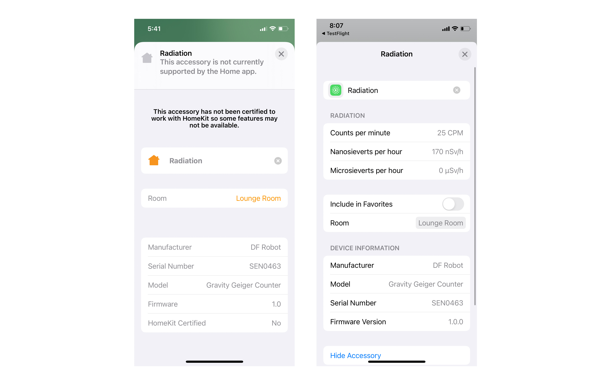

# HomeKit Geiger Counter

An [Apple HomeKit](https://developer.apple.com/homekit/) accessory for the [DF Robot Gravity Geiger Counter SEN0463](https://www.dfrobot.com/product-2547.html) radiation sensor running on a Raspberry Pi.

## Dependencies

* [**Go**](http://golang.org/doc/install) - this accessory is written in Go
* [**HomeControl**](https://github.com/brutella/hc) - to expose climate readings from the Enviro+ as an Apple HomeKit accessory
* [**Geiger Counter**](https://github.com/sighmon/geiger_counter_df_robot_sen0463_esp32_http_server) - to read the Geiger Counter sensor and export it for scraping by [Prometheus](https://prometheus.io)

## Installation

Install this on a Raspberry Pi, or test it on macOS.

### Setup

1. Install [Go](http://golang.org/doc/install) >= 1.14 ([useful Gist](https://gist.github.com/pcgeek86/0206d688e6760fe4504ba405024e887c) for Raspberry Pi)
1. Clone this project: `git clone https://github.com/sighmon/homekit-geiger-counter` and then `cd homekit-geiger-counter`
1. Install the Go dependencies: `go get`
1. Install and run the Geiger Counter Sensor exporter [geiger_counter_df_robot_sen0463_esp32_http_server](https://github.com/sighmon/geiger_counter_df_robot_sen0463_esp32_http_server)

### Build

1. To build this accessory: `go build homekit-geiger-counter.go`
1. To cross-compile for Raspberry Pi on macOS: `env GOOS=linux GOARCH=arm GOARM=7 go build homekit-geiger-counter.go`

### Run

1. Execute the executable: `./homekit-geiger-counter`
1. Or run with the command: `go run homekit-geiger-counter.go`

### Start automatically at boot

1. sudo cp homekit-geiger-counter.service /lib/systemd/system/homekit-geiger-counter.service
2. sudo systemctl daemon-reload
3. sudo systemctl enable homekit-geiger-counter.service
4. sudo systemctl start homekit-geiger-counter.service

### Optional flags

The flag defaults can be overridden by handing them in at runtime:

* `-host=http://0.0.0.0` The host of your sensor
* `-port=1006` The port of your sensor
* `-sleep=3s` The [time](https://golang.org/pkg/time/#ParseDuration) between updating the accessory with sensor readings (`3s` equals five seconds)
* `-dev` This turns on development mode to return a random reading without needing to have a sensor

e.g. to override the port run: `go run homekit-geiger-counter.go -port=8000` or `./homekit-geiger-counter -port=8000`

## Reset this accessory

If you uninstall this accessory from your Apple Home, you'll also need to delete the stored data for it to be able to be re-added.

### macOS

1. Delete the data in the folder created: `homekit-geiger-counter/Radiation/`
1. Restart the executable

### Raspberry Pi

1. Remove the persistent data: `rm -rf /var/lib/homekit-geiger-counter/data`
1. Restart the Raspberry Pi

## Thanks

This project uses the amazing work of [Matthias](https://github.com/brutella). Please consider donating if you found this useful.
